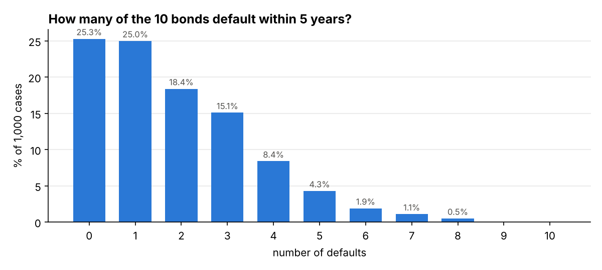
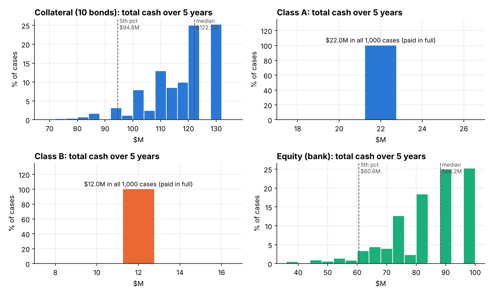
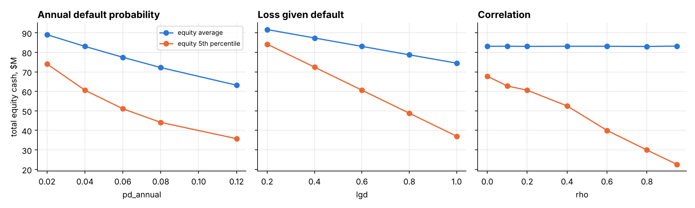

# Project 3 — CDO Cash Flow Simulation (Part 1)

[Read the paper (PDF)](paper/cdo_paper.pdf) · [Model code](cdo_simulation.py)

Arnav Srivastava, Harsh Raj

## Assignment context

Mini-Project 3 asks for a simplified CDO analysis in two parts. Part 1, covered here, asks students to prepare fixed random number simulations for 1,000 cases of 10 assets, produce correlated defaults, and determine the quarterly cash flows of the collateral bonds and the CDO tranches using the BIS debt model. Cases are numbered 1–1,000 so a user can pick one, and the fixed draws are reused in Part 2. The tasks are:

1. Simulate the aggregate quarterly cash flows of the collateral portfolio with correlated default dates.
2. Apply the waterfall to find the cash flows to each class.
3. Provide a statistical analysis of the collateral and class cash flows, with probability distributions and key sensitivities.

Valuation is Part 2 and is not computed here. No lecture files are included.

## Deal structure

| | Collateral (each of 10 bonds) | Class A | Class B | Equity |
| --- | --- | --- | --- | --- |
| Face / notional | $10 MM | $20 MM | $10 MM | Residual |
| Coupon (annual, paid quarterly) | 6% | 2% | 4% | Residual |
| Principal | Quarter 20 | Quarter 20 | Quarter 20 | Residual |
| Priority | — | 1st | 2nd | 3rd |

Credit inputs: annual default probability 4%, LGD 60%, and a "correlation" of 0.20 between default dates. The waterfall pays Class A, then Class B, then the bank's equity each quarter, with no carry-forwards.

## Methodology

1. **Fixed random numbers.** 1,000 × 10 uniform draws turned into standard normals (`=NORM.INV(RAND(),0,1)`), frozen with seed 61032026.
2. **Moment matching.** Demean and whiten with the sample Cholesky factor, so each column has mean 0 and variance 1 and the columns are uncorrelated.
3. **Correlation.** Multiply by the Cholesky factor of a 10 × 10 matrix with 0.20 off the diagonal.
4. **Default dates.** `τ = ln(u) / ln(1 − PD)` with `u = Φ(z)` (Lecture 5, slide 19).
5. **Bond cash flows: BIS defaultable bond model** (Lecture 5, slide 6). Payments before default are paid in full; every scheduled payment from the default quarter on, coupons and principal, is paid at `1 − LGD = 40%`.
6. **Waterfall.** `A = min(TCF, promised A)`, `B = min(TCF − A, promised B)`, `Equity = TCF − A − B`.

The script checks itself and stops with an error if moment matching, cash allocation, the zero-default case, or the slide 6 BIS example (55, 22, 22, 22, 422) fails.

## Results (1,000 cases, USD millions)

| Total cash over 5 years | Collateral | Class A | Class B | Equity |
| --- | ---: | ---: | ---: | ---: |
| Promised | 130.00 | 22.00 | 12.00 | — |
| Mean | 117.05 | 22.00 | 12.00 | 83.05 |
| Standard deviation | 12.00 | 0.00 | 0.00 | 12.00 |
| 5th percentile | 94.60 | 22.00 | 12.00 | 60.60 |
| Median | 122.20 | 22.00 | 12.00 | 88.20 |
| Minimum | 70.30 | 22.00 | 12.00 | 36.30 |

- **Defaults:** 1.853 per case on average (theory 1.846); 18.53% of bonds default within five years (theory 18.46%).
- **Classes A and B are paid in full in every case.** Under the BIS rule, even if all ten bonds default the pool still pays $0.60 MM a quarter and $40.6 MM at maturity, against $0.20 MM and $30.2 MM owed to the notes. All default risk sits with the bank's equity.
- **Sensitivities:** default probability, LGD and the collateral coupon move the average equity payout; correlation leaves the average unchanged but lowers equity's 5th percentile from $60.6 MM (ρ = 0.20) to $40.0 MM (ρ = 0.60).





## Modelling choices

| Choice | Base case | Alternative tested |
| --- | --- | --- |
| Correlation 0.20 | Applied to the normals (class method); default dates correlate at 0.172 | Normal input 0.2307 gives default dates 0.200: equity mean 82.99 vs 83.05 |
| Recovery | BIS: 40% of every payment after default | One-time 40% par recovery: Class B short in 0.5% of cases |
| PAC schedule | None given, so principal at quarter 20 (assumption) | Even quarterly pay-down: Class B short in every case |
| Default probability | Conditional annual probability, `ln(u)/ln(1 − PD)` | PD as hazard rate: equity mean 83.22 |

## Running the model

```bash
pip install -r requirements.txt
python cdo_simulation.py --case 121
```

`--case` selects any case from 1 to 1,000 and prints its bond-by-bond cash flows and waterfall. The run writes `results/` (ignored by git) with default dates, case totals, quarterly averages, sensitivities, alternative readings, `results.json`, and the nine charts used in the paper.

## Files

```text
03-cdo-simulation/
  README.md
  cdo_simulation.py      model, sensitivities and charts
  requirements.txt       numpy, matplotlib
  paper/
    cdo_paper.pdf        10-page write-up
    cdo_paper.tex        LaTeX source
    figures/             charts used in the paper
```
